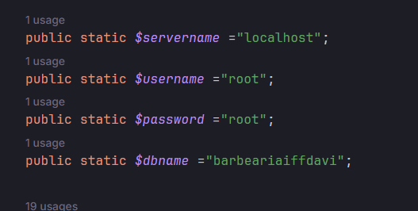

# Como rodar nosso site da barbearia:

1. Tenha o xampp instalado ou instale o apache e
o servidor do mysql manualmente para rodar o backend e o banco de dados.
2. Tenha o node.js instalado.
3. Configure a pasta do apache para a pasta do backend do site
4. Dentro do site abra o arquivo backend\connection.php e configure com as credenciais do banco de dados

5. Abra o phpmyadmin do xampp e importe o arquivo barbeariadavi.sql no seu banco de dados
6. Abra a pasta frontend do site no cmd e digite npm run start
7. Abra o site no navegador
8. Logue com email: adm@gmail.com e senha: 123

### Certifique-se que a porta do servidor backend seja 80 e a porta do servidor react seja 3000!